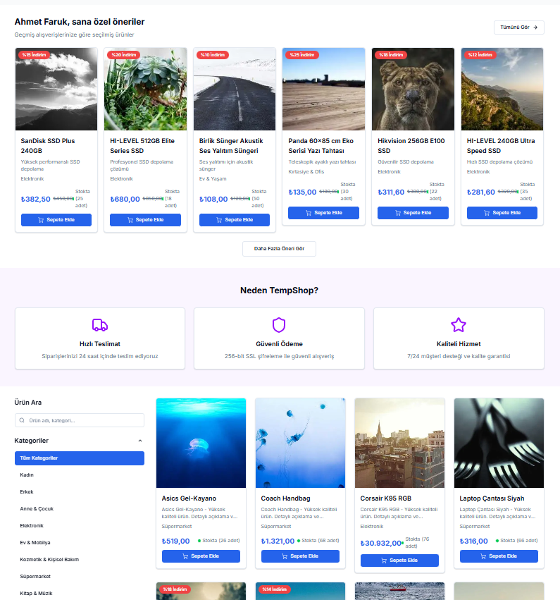
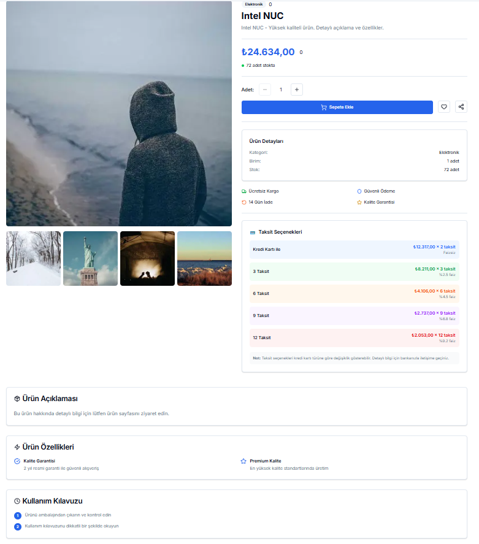
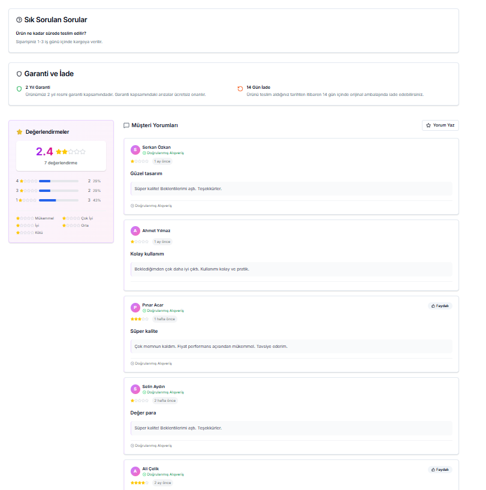

# Modern E-Ticaret Sitesi - Next.js 15 Uygulaması

> **Temp-Shop**: Next.js 15, TypeScript ve Tailwind CSS ile geliştirilmiş, çoklu backend desteği (Mock, .NET Core, Spring Boot) sunan, modern ve ölçeklenebilir e-ticaret platformu.

**Tags**: `nextjs` `typescript` `ecommerce` `tailwindcss` `zustand` `radix-ui` `react-hook-form` `zod` `axios` `dotnet-core` `spring-boot` `postgresql` `shadcn-ui` `responsive-design` `seo-optimization` `modern-ui` `fullstack`

## 📸 Ekran Görüntüleri

### Ana Sayfa
Modern ve kullanıcı dostu ana sayfa tasarımı, hero section, kampanya bannerları ve öne çıkan ürünler.


### Ürün Listeleme ve Kişisel Öneriler
Ürün listeleme sayfası, kişiselleştirilmiş öneriler ve kategori filtreleme özellikleri.



### Ürün Detay Sayfası
Detaylı ürün bilgileri, taksit seçenekleri ve ürün özellikleri.



### Müşteri Yorumları ve SSS
Müşteri değerlendirmeleri, yorumlar ve sık sorulan sorular bölümü.



## 🚀 Özellikler

### Temel Özellikler
- ✅ **Next.js 15**: App Router ile modern React framework
- ✅ **TypeScript**: Tam TypeScript entegrasyonu ve tip güvenliği
- ✅ **Tailwind CSS**: Utility-first CSS framework
- ✅ **State Management**: Zustand ile modern state yönetimi
- ✅ **UI Components**: Radix UI ile erişilebilir bileşenler
- ✅ **Responsive Design**: Mobil-first tasarım yaklaşımı

### E-Ticaret Özellikleri
- 🛍️ **Ürün Listeleme**: Grid ve liste görünümü, sayfalama
- 🔍 **Gelişmiş Arama**: Popup ile günün favorileri, en çok arananlar, otomatik tamamlama
- 🗺️ **Konum Seçimi**: Modal ile şehir ve ilçe seçimi, GPS desteği
- 🛒 **Sepet Yönetimi**: Ürün ekleme, çıkarma, miktar güncelleme
- 💳 **Ödeme Sistemi**: Çoklu ödeme yöntemi desteği
- 📱 **Mobile Navigation**: Hamburger menü, touch optimizasyonları
- 🎨 **Modern UI/UX**: Kullanıcı dostu tasarım, responsive layout
- 📦 **Sipariş Yönetimi**: Sipariş geçmişi, durum takibi
- ⭐ **Favoriler**: Ürünleri favorilere ekleme
- 📍 **Adres Yönetimi**: Çoklu adres desteği
- 💳 **Ödeme Yöntemleri**: Kart ve hesap bilgilerini kaydetme

### Gelişmiş Özellikler
- 🔄 **Backend Switch**: 3 farklı backend desteği (Mock, .NET Core, Spring Boot)
- 🔧 **Backend Config UI**: Ayarlar sayfasından endpoint yönetimi
- 📢 **Toast Notifications**: Kullanıcı bildirimleri
- 🏷️ **Kampanyalar**: İndirim ve kampanya yönetimi
- 📊 **Genişletilmiş Mock Data**: 200+ ürün, kategoriler, yorumlar
- 🏪 **Kategori ve Alt Kategoriler**: Dinamik mega menü
- 📄 **SEO Optimizasyonu**: Tüm sayfalarda metadata, Open Graph, structured data
- 🦶 **Footer**: Kapsamlı footer ile tüm bağlantılar
- 👩‍💼 **Satıcı Sayfası**: Satıcı başvuru ve bilgilendirme
- 🎁 **Premium Üyelik**: Özel avantajlar sayfası
- 🔒 **Güvenlik Ayarları**: 2FA, şifre değiştirme
- 🔔 **Bildirimler**: Kullanıcı bildirimleri ve tercihler

## 🛠️ Teknolojiler

- **Framework**: Next.js 15 (App Router)
- **Language**: TypeScript 5.3+
- **Styling**: Tailwind CSS 3.3+
- **State Management**: Zustand 4.4+
- **UI Components**: Radix UI, Lucide React
- **Form Management**: React Hook Form, Zod
- **HTTP Client**: Axios
- **Notifications**: React Hot Toast
- **Icons**: Lucide React
- **Build Tool**: Next.js (Turbopack)

## 📦 Kurulum

1. **Bağımlılıkları yükleyin:**
```bash
npm install
```

2. **PostgreSQL veritabanını kurun:**
```bash
# PostgreSQL'de veritabanını oluşturun
psql -U postgres -f setup-database.sql
```

3. **Environment dosyasını oluşturun:**
```bash
# env.example dosyasını .env.local olarak kopyalayın
cp env.example .env.local
```

4. **Backend seçimi yapın (.env.local dosyasında):**
```bash
# Mock data için
NEXT_PUBLIC_BACKEND_TYPE=mock

# Spring Boot için
NEXT_PUBLIC_BACKEND_TYPE=spring

# .NET Core için
NEXT_PUBLIC_BACKEND_TYPE=dotnet
```

5. **Backend'i çalıştırın (seçtiğiniz backend'e göre):**

**Spring Boot:**
```bash
cd backend-spring
./mvnw spring-boot:run
```

**.NET Core:**
```bash
cd backend-dotnet
dotnet run
```

6. **Frontend'i çalıştırın:**
```bash
npm run dev
```

7. **Tarayıcıda açın:**
```
http://localhost:3000
```

## 🏗️ Proje Yapısı

```
├── src/app/                   # Next.js App Router
│   ├── globals.css           # Global CSS
│   ├── layout.tsx            # Root layout
│   ├── page.tsx              # Ana sayfa
│   ├── products/             # Ürün sayfaları
│   ├── cart/                 # Sepet
│   ├── checkout/             # Ödeme
│   ├── search/               # Arama sayfası
│   ├── campaigns/            # Kampanyalar
│   ├── categories/           # Kategoriler
│   ├── orders/               # Siparişler
│   ├── favorites/            # Favoriler
│   ├── addresses/            # Adresler
│   ├── payment-methods/      # Ödeme yöntemleri
│   ├── settings/             # Ayarlar
│   ├── security/             # Güvenlik
│   ├── notifications/        # Bildirimler
│   ├── premium/              # Premium üyelik
│   ├── seller/               # Satıcı ol
│   ├── customer-service/     # Müşteri hizmetleri
│   ├── entrepreneur-women/   # Girişimci kadınlar
│   ├── international/        # Yurt dışından
│   ├── about/                # Hakkımızda
│   ├── help/                 # Yardım
│   ├── robots.ts             # SEO robots
│   └── sitemap.ts            # SEO sitemap
├── src/components/           # Bileşenler
│   ├── ui/                   # Shadcn UI bileşenleri
│   ├── navigation.tsx        # Ana navigasyon
│   ├── mobile-navigation.tsx # Mobile menü
│   ├── footer.tsx            # Footer
│   ├── location-modal.tsx    # Konum seçimi
│   ├── search-popup.tsx      # Gelişmiş arama
│   ├── product-card.tsx      # Ürün kartı
│   ├── product-grid.tsx      # Ürün grid
│   ├── category-grid.tsx     # Kategori grid
│   ├── campaign-grid.tsx     # Kampanya grid
│   └── backend-switch.tsx    # Backend seçici
├── src/store/                # Zustand stores
│   ├── cart-store.ts         # Sepet
│   ├── product-store.ts      # Ürünler
│   ├── auth-store.ts         # Kimlik doğrulama
│   └── backend-store.ts      # Backend config
├── src/services/             # API servisleri
│   ├── product-service.ts    # Ürün API
│   ├── category-service.ts   # Kategori API
│   ├── order-service.ts      # Sipariş API
│   ├── favorite-service.ts   # Favori API
│   └── mock-data-service.ts  # Mock data
├── src/data/                 # Mock data
│   └── mock-data-extended.ts # Genişletilmiş mock data
├── src/config/               # Konfigürasyon
│   └── api.ts                # API config
├── src/types/                # TypeScript types
│   └── index.ts
├── public/                   # Statik dosyalar
├── env.example               # Environment örneği
├── tailwind.config.js        # Tailwind config
├── next.config.js            # Next.js config
└── tsconfig.json             # TypeScript config
```

## 🎯 Kullanım

### Ürün Görüntüleme
- Ana sayfada ürünleri listeleyin
- Arama çubuğunu kullanarak ürün arayın
- Filtreleme paneli ile ürünleri filtreleyin
- Ürün kartlarına tıklayarak detayları görüntüleyin

### Sepet İşlemleri
- Ürünleri sepete ekleyin
- Sepet miktarını güncelleyin
- Ürünleri sepetten çıkarın
- Sepeti temizleyin

### Ödeme İşlemi
- Sepet sayfasından ödemeye geçin
- Teslimat bilgilerini girin
- Ödeme yöntemini seçin
- Siparişi tamamlayın

## 🔧 Geliştirme

### TypeScript Konfigürasyonu
- `tsconfig.json` dosyasında TypeScript ayarları
- Strict mode aktif
- Path mapping yapılandırması

### Redux Store
- Type-safe Redux store
- Cart state yönetimi
- Action creators ve reducers

### API Entegrasyonu
- Axios ile HTTP istekleri
- Type-safe API responses
- Error handling

## 🚀 Build ve Deploy

### Production Build
```bash
npm run build
```

### Test
```bash
npm test
```

## 📝 API Endpoints

Uygulama aşağıdaki API endpoint'lerini kullanır:

- `GET /api/products/getall` - Tüm ürünleri getir
- `GET /api/products/getByProductName` - Ürün adına göre getir
- `GET /api/products/{id}` - ID'ye göre ürün getir
- `GET /api/products/category/{id}` - Kategoriye göre ürünler
- `GET /api/products/search` - Ürün arama
- `GET /api/products/featured` - Öne çıkan ürünler
- `GET /api/products/discounted` - İndirimli ürünler

---